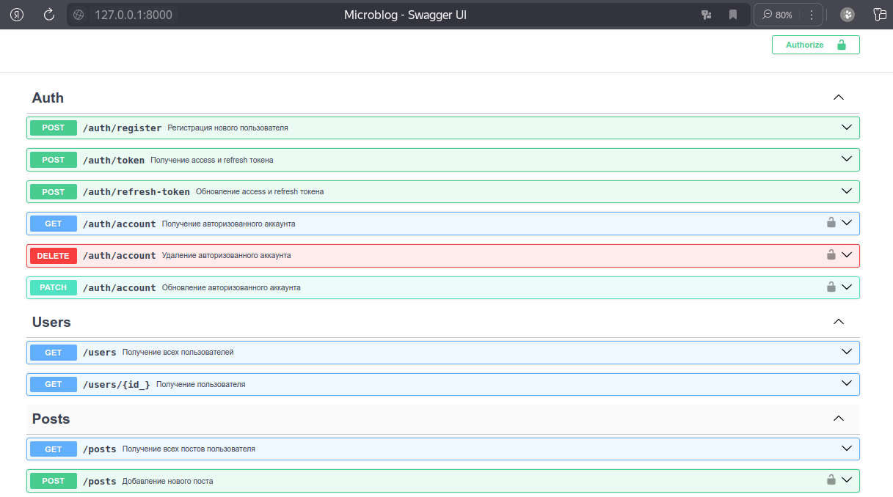

## Запуск приложения при помощи Docker

- **git clone <https://github.com/darialissi/fastapi-microblog.git>**

- **cd fastapi-microblog && bash script.sh**
  
- **docker-compose up**

#

После запуска приложения **Swagger UI** доступен на <http://127.0.0.1:8000/docs>
